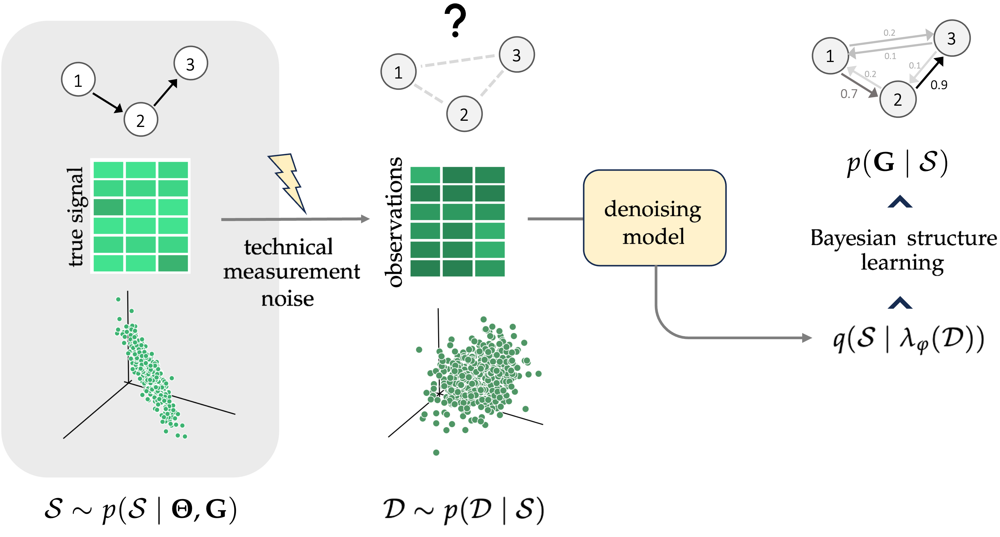
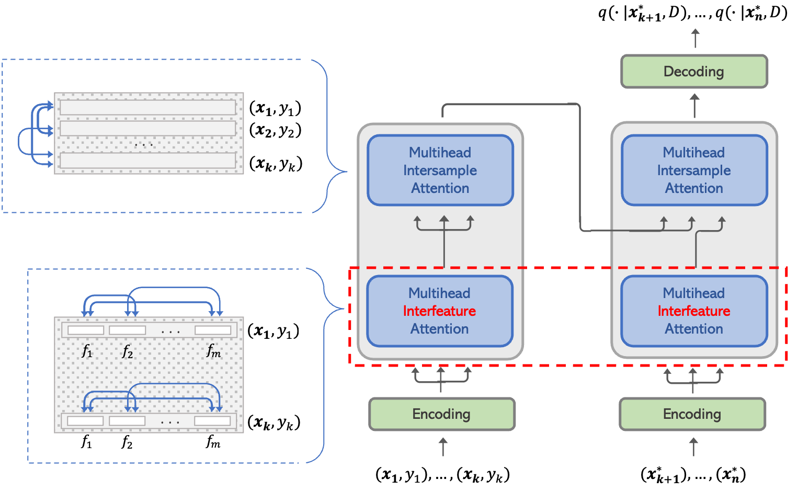

# Data Scientist - Profile & Portfolio

Hey! I'm Ugne, a recent MSc in Statistics graduate with solid experience in the financial sector as a former credit ratings analyst of Swiss, German, and Austrian banks. 

The master's program has trained me both as a statistician and computer scientist: from building the theoretical foundation of Statistical and Machine Learning models to lots of hands-on experience with current state-of-the-art ML techniques, training deep neural networks on HPC cluster and developing a novel methodology to improve causal discovery with application to synthetic single-cell RNA sequencing data. 

I'm glad to share more details here on the super interesting projects I've worked on - welcome and enjoy the read!  
&nbsp;
&nbsp;

## Education

- **Master of Science in Statistics** *@ University of Geneva*
  - master's thesis *@ ETH Zürich*
  - academic exchange, 3rd semester *@ ETH Zürich*

- **Bachelor of Business Management and Analytics** *@ ISM University of Management and Economics*

## Work Experience
**Senior Associate  @ Moody's Investors Service** *(August 2019 – September 2021)*

- credit ratings analyst of Swiss, German and Austrian banks
- performed preliminary credit analysis to support ratings, research, analytical outreach and presentations
- prepared financial spreadsheets and charts
- analyzed data and financial statements and wrote analytical commentary in accordance with Moody’s methodologies

**Accounting and Operations Manager @ butiq.lt** *(August 2017 – June 2019)*
- performed various finance and accounting-related tasks
- was responsible for inventory accounting and management activities
- prepared monthly sales and stock reports for various suppliers
- ensured smooth day-to-day operations in inventory accounting systems
  
## Projects

### Denoising Representation Learning for Causal Discovery <be> (Master's Thesis)

*@ Learning & Adaptive Systems Group at the Department of Computer Science of ETH Zürich*

*Supervisors: Prof. Sebastian Engelke, Prof. Bernhard Schölkopf, Lars Lorch*

In this work, we introduce a principled approach for learning a latent causal representation of the data that is corrupted with measurement errors. In most real-world settings, the data-collection process involves varying levels of inaccuracies that distort the true outcomes from the causal generative mechanism, which makes it hard to uncover the underlying causal structure among variables in the system. Our proposed method bridges the gap between causal structure learning and the problem of measurement errors by learning a *probabilistic denoising model* that is designed to uncover the signal from a causal generative mechanism which is generally unobservable. In our experiments, we found a noticeable performance improvement when combining our denoising model with both classical and Bayesian structure learning methods. 

### iTabPFN: Extending the Transformer Architecture in TabPFN with Interfeature Attention
*@ Deep Learning course at the Department of Computer Science of ETH Zürich*

iTabPFN is a Transformer designed to solve small classifiction tasks in tabular setting within seconds. Even with such an increase in speed, the performance of iTabPFN is comparable to baseline methods such as tree-based models (XGBoost, LightGBM). The architecture of iTabPFN is built upon [TabPFN](https://arxiv.org/abs/2207.01848). Our main contribution is an extension of TabPFN Transformer with an additional interfeature attention component, designed to effectively leverage on the row-column structure of tabular data.

